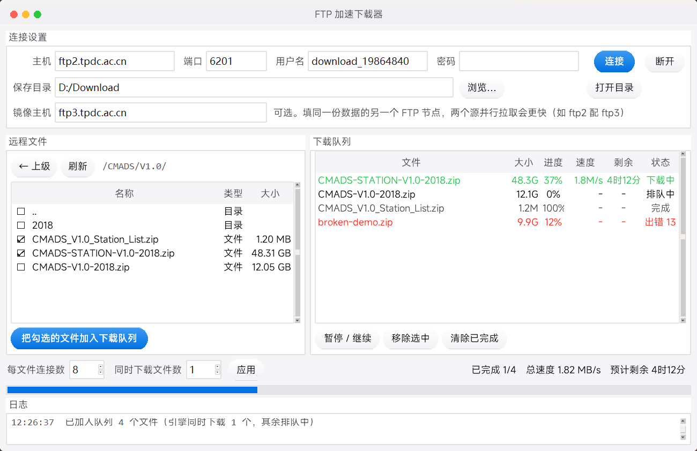

# FTP 加速下载器 (FTP Accelerator)

一个带图形界面的 FTP 多线程分段下载工具，专治科研数据站的「龟速 FTP」。

## 为什么需要它

很多科研数据平台（例如国家青藏高原科学数据中心 TPDC）只提供 FTP 下载，并且对单条连接做了限速 ——
实测经常只有几十 KB/s。而 **FileZilla 这类客户端只能多文件并发，无法把单个大文件切开**，
所以下一个 50 GB 的压缩包能等到天荒地老。

本工具内置 [aria2](https://aria2.github.io/) 引擎，把单个大文件切成 N 段并行拉取，
绕开服务器的单连接限速。项目自带的端到端测试会验证这一点：一个 8 MB 文件可稳定切成 8 段并发下载，
服务器端能观测到 8 个不同的 `REST` 起始偏移。

## 功能

- 图形界面，双击即用（单文件 exe，无需安装 Python）
- 仿 Mac 窗口样式（自绘标题栏 + 红黄绿三圆点），胶囊 / 玻璃质感按钮
- 连接 FTP、浏览远程目录、勾选要下载的文件
- 单文件多连接分段下载（1–16 段可调）
- **同一文件多源并行**：填一个镜像主机，两个 FTP 节点的限速各自独立，带宽可叠加
- 断点续传、失败自动重试
- 实时进度 / 速度 / **预计剩余时间**，队列总进度条
- 自动记住上次的连接参数与保存目录（密码不落盘）

## 界面



## 快速开始

### 方式一：直接用打包好的程序

下载 `FTPAccelerator.exe`，双击运行。

1. 填主机 / 端口 / 用户名 / 密码，点「连接」
   （例：TPDC 为 `ftp2.tpdc.ac.cn`，端口 **`6201`**，注意不是 21）
2. 在左侧浏览远程目录，**单击文件行勾选**（☑），双击目录进入
3. 点「把勾选的文件加入下载队列」
4. 选好保存目录、按需调整「每文件连接数」，开始下载

### 方式二：从源码运行

```bash
python ftp_accel.py
```

需要 Python 3.8+（含 tkinter），且 `third_party/aria2/aria2c.exe` 存在（仓库已内置）。

### 自行打包

```bash
E:\Python\python.exe build.py     # 或 python build.py
```

产物：`dist/FTPAccelerator.exe`。改 `build.py` 顶部的常量即可改名 / 换图标 / 换解释器。

## 多文件下载与排队

勾选多个文件后点「加入下载队列」，它们会**全部进入队列**，由引擎按「同时下载文件数」并发下载，
其余显示为「排队中」，一个完成自动接下一个，不需要重复操作。

- 默认「同时下载文件数」= 1：一次只下一个，对服务器最友好（很多数据站限制单 IP 连接数）
- 想同时下多个就调到 2–3，但注意别超过服务器允许的单 IP 连接上限
- 队列状态含义：`下载中` / `排队中` / `已暂停` / `完成` / `出错`

## 镜像主机（同一文件多源并行）

在连接区第二行填「镜像主机」，同一个文件就会**同时从两个 FTP 节点拉**：

```
主机       ftp2.tpdc.ac.cn
镜像主机   ftp3.tpdc.ac.cn        ← 填这一栏
```

原理：服务器限速通常按「单条连接」或「单 IP 到单节点」计算，两个节点的额度互不相干，
所以总带宽可以叠加。aria2 会把 `--split` 切出来的那些分段摊给两个源。

注意事项：

- 两个站点上**该文件的路径必须完全一致**（本工具会自动用同样的远程路径拼第二个源）
- 总连接数不变，只是把同样的段数分给两台机器；想让每台都多开，就把「每文件连接数」调高
- 镜像节点通常要用**同一个账号**，密码复用当前填的那份
- 不确定有没有第二个节点时，留空即可，行为与之前完全一样

## 速度调优速查

按「见效程度」排序，前三条是真正提升网速的，后面几条是避免拖后腿的：

| 手段 | 位置 | 说明 |
|---|---|---|
| 每文件连接数 | 设置区，1–16 | **最有效**。单连接被限速时，8 段通常就能把带宽拉满。aria2 硬上限就是 16，填多了任务会被直接拒绝（程序已自动钳到 1–16） |
| 镜像主机 | 连接区第 2 行 | 第二个 FTP 节点，限速独立 → 带宽叠加 |
| 同时下载文件数 | 设置区，1–10 | 多文件并行。注意别超过服务器单 IP 上限，很多站会因此封 IP |
| 不预分配磁盘 | 已默认开启 | 只影响磁盘，不提升网速；但不关掉会因磁盘打满而卡住整个系统 |
| 关闭用户 aria2.conf | 已默认开启 | 见下方「已知注意事项」，防止外部配置偷偷限速 |
| 舍弃僵死连接 | 已默认开启 | `lowest-speed-limit=1K`：某条连接完全不吐数据就弃掉重连，不让它拖住整个任务 |
| 快速重连 | 已默认开启 | `retry-wait=5`：服务器 2 分钟会踢空闲连接，5 秒即可续上 |
| 错峰下载 | —— | 数据站总并发有限（如 TPDC 的 ftp2 上限 500、ftp3 上限 250），高峰期本就拥塞，凌晨通常更快 |

**不建议开启的**：aria2 的 `--optimize-concurrent-downloads`。它会按实测带宽自动放大并发
（默认系数在 100 Mbps 网络下会开到 50 个以上并行下载），对只允许有限并发的科研数据站来说
很可能直接被判为攻击而封 IP。

## 已知注意事项

- 服务器空闲 **2 分钟**会自动断开；程序在列目录失败时会**自动重连**，不用重新点「连接」。
  下载本身的断点续传默认开启，掉线后重跑即可续上
- **不预分配磁盘空间**（aria2 `file-allocation=none`）。预分配会在下载**开始前**先把整个文件
  大小的空间写满 —— 几十 GB 的包会瞬间把磁盘打满、整个系统卡顿，所以默认关闭。
  代价：文件会有些碎片，且磁盘空间不足时会下到中途才报错，请提前留足空间
- **会忽略用户自己的 aria2 配置**（启动引擎时加 `--no-conf=true`）。
  本版 aria2 默认会加载 `~/.config/aria2/aria2.conf`，如果那份文件里写着
  `max-overall-download-limit` 之类的全局限速，下载会在背后被掐住而不报任何错。
  为了结果可预期，程序一律不读它
- 部分数据站总连接数有限（如 TPDC 的 ftp2 上限 500、ftp3 上限 250），高峰期本就拥塞，凌晨通常更快
- 下载 1 TB 数据请预留 **2 TB+** 磁盘空间（下载 + 解压）

## 项目结构

```
ftp_accel.py                  主程序（tkinter 界面 + aria2 RPC 引擎封装）
build.py                      一键打包脚本（PyInstaller）
third_party/aria2/            内置 aria2 引擎及许可证
_test/test_ftp_download.py    端到端测试（迷你 FTP 服务器 + MD5 校验，验证分段真发生）
_test/test_reconnect.py       控制连接被强制断开后的自动重连
_test/test_speed_opts.py      参数落实验证（读回 aria2 实际生效的选项 + --no-conf A/B 对照）
_test/diagnose_speed.py       连接数扫描（1/2/4/8/16），自动给结论
dist/                         打包产物
```

## 测试

```bash
E:\Python\python.exe _test\test_ftp_download.py    # 分段 + 完整性
E:\Python\python.exe _test\test_reconnect.py       # 自动重连
E:\Python\python.exe _test\test_speed_opts.py      # 参数真的生效了吗
```

带界面的程序还有一条无界面自检，用于验证打包产物是否完整：

```bash
FTPAccelerator.exe --selftest      # 结果写到 %TEMP%\ftp_accel_selftest.txt
```

## 内置引擎与许可

本程序通过子进程调用 [aria2](https://aria2.github.io/)（`third_party/aria2/aria2c.exe`，
版本 1.37.0，**GPLv2**）完成实际下载；aria2 的许可证见 `third_party/aria2/COPYING`。
aria2 以独立进程方式被调用，本程序自身代码以 **MIT** 许可发布，见 `LICENSE`。

## 更新日志

- **v1.5.0** —— 三处界面修复 + 四项速度优化：
  - 修复：首次拖动窗口时顶部会出现一条多余的空栏（去标题栏后没有让系统重算非客户区，
    改用 `SetWindowPos(SWP_FRAMECHANGED)`，现在上边框与左右一致，只有一条 10px 缩放边）
  - 全部按钮改为**胶囊 / 玻璃质感**（Canvas 逐行扫描线渐变 + 顶部高光 + 底部描边）
  - **新增「镜像主机」**：同一文件双源并行，两个节点的限速独立，带宽可叠加
  - **新增 `--no-conf=true`**：不再读取用户级 `aria2.conf`。
    此前若该文件带有全局限速，下载会被静默掐住（实测可低至 1 KB/s）
  - **新增 `lowest-speed-limit=1K`**：卡死不再吐数据的连接被弃掉重连，不再拖住整个任务
  - `min-split-size` 4M → **1M**：aria2 不会切出小于 2×SIZE 的段，改小后中小文件也能拿满连接数
  - `retry-wait` 20s → **5s**：掉线后快速续上
  - 连接数 / 并发数在入参处钳到 1–16 与 1–10，手打超范围不再导致整个任务被引擎拒绝
- **v1.4.0** —— 对齐本仓库**四应用共用的设计令牌**（与 word-hub / coord-kit / life-map 同一套）：
  画布 `#f5f5f7` + 白卡 `#ffffff` + 细边 `rgba(0,0,0,.08)` + 正文 `#1d1d1f` + 次要 `#56565c`，
  **品牌色改用 `#0071e3`**（原来是自己定的黑色），状态色统一为 `#34c759`/`#ff9500`/`#ff3b30`；
  字体按 word-hub 的字体栈探测（MiSans → PingFang SC → Microsoft YaHei UI）
- **v1.3.0** —— 窗口改为**仿 Mac 样式**：自绘标题栏（左侧红黄绿三圆点、居中标题），
  摘掉 Windows 原生标题栏（走 Win32 只去掉 `WS_CAPTION`，保留任务栏图标与边框缩放）。
  红点关闭 / 黄点最小化 / 绿点最大化，标题栏可拖动、双击最大化
- **v1.2.0** —— 界面改为浅色极简风格。修复 5 个问题：
  ① RPC 端口写死，残留实例占着端口时启动失败，且报错是「启动超时」很难排查（改为每次取空闲端口）；
  ② 列目录在主线程做网络 I/O，服务器慢时会冻住整个界面（改为后台线程 + UI 队列）；
  ③ 后台线程直接操作 tkinter（线程不安全，会抛 `main thread is not in main loop`）；
  ④ 暂停/继续靠「先试 pause 失败再试 unpause」的碰运气逻辑，对已完成任务语义混乱；
  ⑤ 移除已完成任务无效（aria2 对已完成任务需要 `removeDownloadResult` 而非 `forceRemove`）
- **v1.1.0** —— 关闭磁盘预分配（原先会在下载开始前先把整个文件大小的空间写满，几十 GB 的包
  瞬间打满磁盘并卡住系统）；队列增加预估剩余时间、总进度条、状态着色、清除已完成
- **v1.0.0** —— 首个版本

## 许可

MIT License
